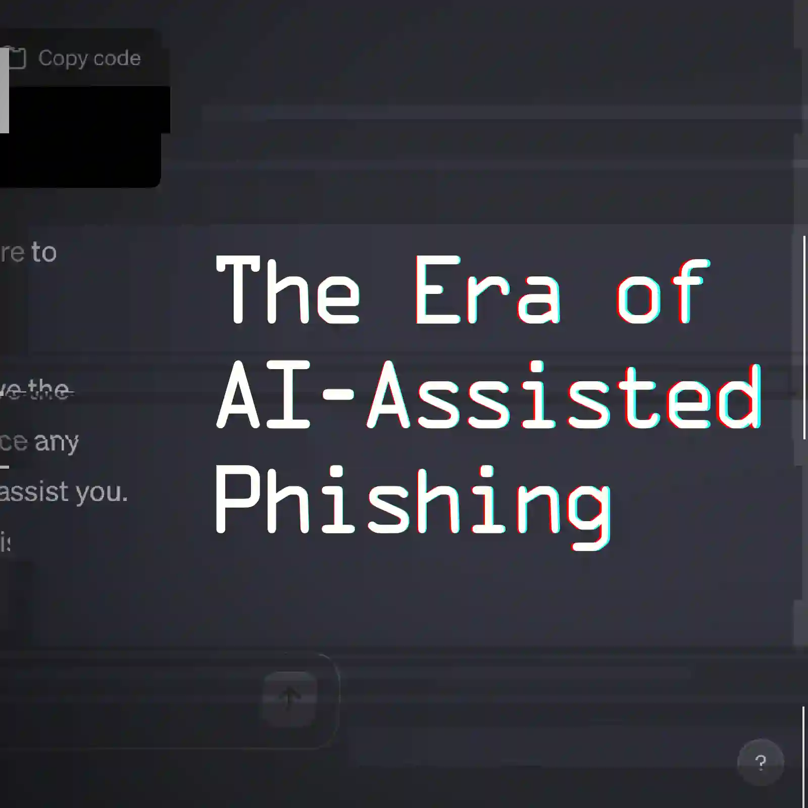

## My Encounter with AI Assisted Phishing

I had never experienced phishing like this before. I assumed way too much, and that almost got me into trouble.

I had been sending out job applications and scheduling interviews. Along comes an email from a Joe Sacco at Broward Motorsports, thanking me for applying, and requesting to interview me the next morning 10am EST (7am my time). I could find no trace of ever having applied to Broward Motorsports. I accepted the appointment with the idea that I would clear up this confusion on the call, maybe they posted the job under another business name. I didn't know how the meeting would be connected (Zoom!, phone, etc.) and expected to receive an email with such instructions. The morning of, I had to ask about this. I received not answer and there was no apparent attempt to contact me. I then received another email requesting that I complete an assessment, prior to conducting an interview. The email also mentioned that they were using AI for their hiring process. More assumptions went through my head, such as whether I had confirmed the appointment time too late, or perhaps the assessment was the company's idea of an interview. The assessment questions were a very pertinent set about WordPress, most of which I knew, the rest of which was easy enough to find on line. They were totally legit questions, though some of them were too easy. I turned it in and later found another email from them offering me the job, and to provide my physical address for their job offer letter. This is when I really started to wonder about the legitimacy of this whole correspondence. I looked up the company again and found them at browardmotorsports.com. The emails I had been receiving came from browardmotorsports.org, so I checked their as well. The .org site was a placeholder while the .com site was a complete website with phone, physical address, etc. Did they also own the .org domain name? Did they have plans for their new web developer (me?) to build something there? More questions I didn't ask about. Yes, it did occur to me that phishers could be posing as Broward Motorsports to convince me they're legit. But by this time they had already sent me so much convincing correspondence which could have been legit, I couldn't be sure. This is when I should have called the company directly. But the email urged me to respond quickly as they wanted to hire rapidly. So, reluctantly and because I didn't want to overthink it, I sent my physical address and phone. I couldn't easily think of why anyone would be leading me on for so long and not jumping ahead to try to get more data out of me as phishers usually do. Later that day my wife brought up the notion that it could all be generated by AI, as some of the grammar was a bit weird. That gave me a sick feeling in my stomach. I decided I would call the company the next day, get a hold of this Joe Sacco, and verify that he actually selected me for a Web Developer role and intended to hire me. The next day came and I received more emails from Joe Sacco, one with an HR letter so sign and saying to be on the lookout for further correspondences regarding the hiring process and onboarding. Before answering any further emails I tracked down the corperate headquarters' number and asked for Joe Sacco. They thought I meant "JJ" so they transferred me to him. When I asked "JJ" about it, he said no, he wasn't hiring any web developers and said I was the second one who called about it. He asked if it was a .org email address (to which I said "yes") and pointed out they they own the .com domain. He asked me again who contacted me. I told him it was Joe Sacco. He explained that Joe Sacco is the Sales Manager at their Palm Beach location and that he wouldn't be hiring any web developers. After that call I reported the email chain to my email provider (Proton Mail).

I always knew such a convincing scam could be orchastrated if the phisher were to put sufficient thought, time and effort into it. But observation has shown that they won't do so, they give themselves way to quickly, and they're content with targeting the low-hanging fruits (those who are less tech savvy, especially older generations). But it appears that isn't the case anymore as AI can now effectively assist with much more methodical phishing tactics.

My biggest mistakes in this experience were:

1. Assuming way too much.
2. Not demanding direct live communication sooner.

So my suggestions for avoiding this sort attack are:

1. When some doesn't look right, find out more, and repeat until it all makes sense. Don't assume.
2. Demand live communication, but you reach out to them. Don't wait for them to tell you how to contact them. Look them up yourself. If they're real, you should be able to find them without their help and confirm they actually contacted you.
